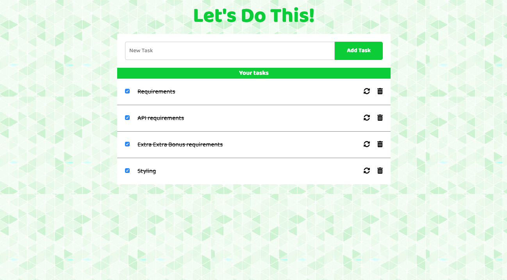

# W3D5 - PROJECT - ToDo list

## **Requirements:**

- Als gebruiker wil ik een inputveld zien waarin ik mijn taak in kan vullen.
- Als gebruiker kan ik op een button drukken met de tekst "Add Task" waardoor je ingevulde taak toegevoegd wordt aan de lijst.
- Als gebruiker zie ik wanneer ik op de add button knop heb geklikt, de taak verschijnen in mijn takenlijst.
- Taak verwijderen: Als gebruiker kan ik in de takenlijst op een icoontje klikken van een prullenbak, rechts naast de taak, waardoor de taak uit mijn takenlijst wordt verwijderd.

## **API requirements:**

- GET: Verkrijg de (initiële) lijst met taken van de database.
- POST: Update de takenlijst met 1 nieuwe taak. 
Stuur alleen `{description: "blah", done: true}`
**Firebase genereert zelf een hash (een id) voor je taak.**
- DELETE: Verwijder een taak uit de database. Gebruik de hash als identifier.
- Maak een file genaamd `api-client.js` zoals je hebt geleerd in de afgelopen week voor al je requests.

## **Extra Extra Bonus :**

🚀  Extra requirements: 

- Taak doorstrepen: Als gebruiker kan ik in de takenlijst op een checkbox klikken, links naast de taak, waardoor de tekst van de taak doorgestreept wordt en ik mijn taak kan afstrepen.
- Als gebruiker wil ik op mijn taak kunnen klikken en de tekst kunnen aanpassen.

🚀  Extra API requirements (die samenhangt met het bovenstaande):

- PUT: update een bestaande taak de property done of niet done.
- PUT: update en bestaande taak met de PUT method.

## **Design**:

Ook deze week: styling is niet belangrijk. 
Spendeer niet de veel tijd aan stylen! Focus je eerst op functionaliteiten en daarna pas op stylen.

